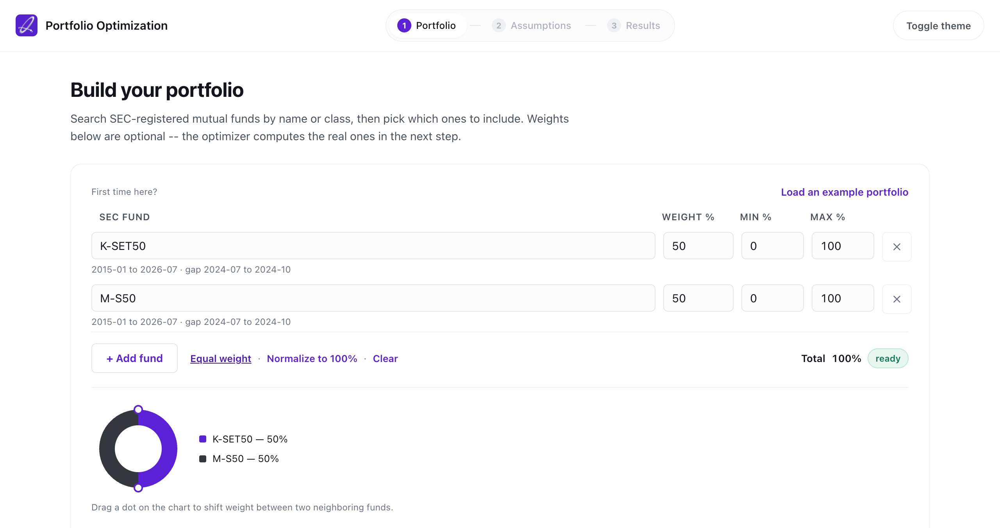

<div align="center">

<picture>
  <source media="(prefers-color-scheme: dark)" srcset="docs/assets/author-logo-dark.png">
  
</picture>

# Portfolio Optimization

**Portfolio optimization (mean-variance, Black-Litterman, risk parity, HRP/HERC) on SEC Thailand Open Data mutual fund NAV series**

> Forked from [Portfolio Backtester](../Backtest%20Portfolio%20Webull%3ASEC%20OPENAI) — reuses its SEC Thailand NAV data pipeline; the optimization engine itself is new (see `docs/optimization-assumptions.md`).

[](LICENSE)
[](pyproject.toml)
[](backend/app/main.py)
[](frontend/package.json)

Built by [**Supachok Julaupay**](https://github.com/bblank09) &middot; [github.com/bblank09](https://github.com/bblank09)

</div>

## Table of Contents

1. [Abstract](#1-abstract)
2. [Motivation & Research Question](#2-motivation--research-question)
3. [Screenshots](#3-screenshots)
4. [System Architecture](#4-system-architecture)
5. [Methodology](#5-methodology)
6. [Features](#6-features)
7. [Installation & Setup](#7-installation--setup)
8. [Usage](#8-usage)
9. [Project Structure](#9-project-structure)
10. [Testing & Validation](#10-testing--validation)
11. [Example Output](#11-example-output)
12. [Success Metrics](#12-success-metrics)
13. [Limitations & Known Issues](#13-limitations--known-issues)
14. [Roadmap](#14-roadmap)
15. [License](#15-license)
16. [Acknowledgments & Data Attribution](#16-acknowledgments--data-attribution)

---

## 1. Abstract

This project answers a different question than its parent backtester: *given a universe of Thai mutual funds, what allocation would have been optimal under a stated objective (max Sharpe, min variance, risk parity, Black-Litterman, HRP/HERC), and how robust is that "optimal" weighting when re-evaluated out-of-sample on a rolling window?*

It is a full-stack application — a FastAPI optimization engine (built on [riskfolio-lib](https://riskfolio-lib.readthedocs.io/en/latest/)) over the same cached SEC Thailand Open Data NAV series as the parent project, and a React/TypeScript dashboard for building a fund universe, choosing an optimization objective, and inspecting results (efficient frontier, optimal weights, risk contribution breakdown, and rolling out-of-sample performance).

**Status:** assumptions and methodology decided (see [`docs/optimization-assumptions.md`](docs/optimization-assumptions.md) for the full decision record and sources), and the Assumptions/Results UI fields are fully spec'd (see [`docs/mock-ui-spec.md`](docs/mock-ui-spec.md)); the optimization engine, backend wiring, and actual UI are not yet implemented — see Roadmap.

## 2. Motivation & Research Question

Retail investors and quant-finance students in Thailand have no free, transparent tool to backtest portfolios built from Thai mutual funds specifically — global tools such as [Portfolio Visualizer](https://www.portfoliovisualizer.com/) and [testfol.io](https://testfol.io/) cover US/global assets but not SEC Thailand's fund universe.

**Research question:** given a set of SEC-registered mutual funds, target weights, a historical window, and a cashflow/rebalancing/cost policy, what is the resulting time-weighted return, volatility, drawdown profile, and benchmark-relative risk — computed transparently enough that every number traces back to a stated formula and a cached, inspectable NAV series?

The project deliberately excludes Monte Carlo simulation, portfolio optimization, efficient frontier construction, and live trading/broker execution — the scope is historical backtesting only, done rigorously.

## 3. Screenshots



_Step 1 of the guided workflow (Portfolio → Objective → Assumptions → Results): search-driven fund picker, live weight validation, and an allocation donut chart. A dark theme is also available via the top-bar toggle._

## 4. System Architecture

```mermaid
flowchart LR
    SEC["SEC Open Data API<br/>(fund NAV, profiles)"]
    SECMOD["backend/app/sec/<br/>fetch + normalize"]
    CACHE[("data/sec/normalized/<br/>*.parquet cache")]
    ENGINE["backend/app/engine/<br/>backtest calculations"]
    API["backend/app/api/<br/>FastAPI REST (/api/v1/*)"]
    FE["frontend/src/<br/>React + TypeScript UI"]
    USER(["User's browser"])

    SEC -- "download NAV/profiles\n(scripts/sec_download_mvp.py)" --> SECMOD
    SECMOD -- "normalize + write" --> CACHE
    CACHE -- "load_nav_panel()" --> ENGINE
    API -- "run_backtest(request, nav)" --> ENGINE
    ENGINE -- "result JSON" --> API
    USER -- "build portfolio,\nset assumptions" --> FE
    FE -- "POST /api/backtests\nGET /api/funds, /api/data-status" --> API
    API -- "result / funds / status JSON" --> FE
    FE -- "render tabs:\nSummary, Growth, Drawdown,\nReturns, Metrics, Cashflows,\nRebalancing, Report" --> USER

    classDef external fill:#f3effc,stroke:#8b5cf6,color:#3a2a5c;
    classDef storage fill:#e7f6ee,stroke:#34c98a,color:#123527;
    class SEC,USER external;
    class CACHE storage;
```



Everything downstream of the parquet cache is a pure function of it: `run_backtest()` never calls the SEC API directly, so a backtest result is always reproducible from `data/sec/normalized/` alone, and the app works fully offline once the cache is populated.

**Tech stack**

| Layer | Technology |
| --- | --- |
| Frontend | React 18, TypeScript, Vite, hand-built SVG charting (no charting library dependency) |
| Backend | FastAPI, Pydantic v2, pandas, numpy, scipy |
| Data | SEC Thailand Open Data API, cached locally as Parquet |
| Testing | pytest (backend engine + API), tsc (frontend type-check) |

**Data flow:** SEC Open Data → `backend/app/sec/` fetch + normalize → local Parquet cache → `backend/app/engine/` computes the backtest against the cached panel → `backend/app/api/` serves the result → the frontend renders it across nine analysis tabs (Summary, Overview, Growth, Drawdown, Returns, Metrics, Cashflows, Rebalancing, Report).

## 5. Methodology

Full methodology and every formula used are documented and versioned in-repo, not just in this README:

- [`docs/methodology.md`](docs/methodology.md) — data source, NAV alignment rules, cashflow/rebalancing treatment, and how missing data is handled (never forward-filled into a fabricated return).
- [`docs/formula-reference.md`](docs/formula-reference.md) — every metric's exact formula (TWRR, CAGR, volatility, Sharpe, max drawdown, beta/alpha, tracking error, information ratio) with notation and implementation notes.
- [`docs/sec-api-contract.md`](docs/sec-api-contract.md) / [`docs/sec-data-inventory.md`](docs/sec-data-inventory.md) — the exact SEC Open Data endpoints and fields consumed.
- [`docs/objective-workflows.md`](docs/objective-workflows.md) — how the four objective presets (Past Performance, Monthly DCA, Monthly Withdrawal, Rebalancing Impact) map to required/optional inputs.

The in-app **Report** tab exposes this same audit trail per run: objective, inputs, formulas used, and stated limitations, exportable as `report.md`, `run_config.json`, and `metrics.json`.

## 6. Features

- **Guided 4-step workflow** — Portfolio → Objective → Assumptions → Results, with a top stepper bar; each step is validated before the next unlocks (e.g. weights must sum to 100% before continuing).
- **Search-driven fund picker** — click a fund field to browse the full SEC universe, or type to filter (by `proj_id`, fund name, or class); an allocation donut chart updates live as weights change.
- **Objective-driven assumptions** — four presets (Past Performance, Monthly DCA, Monthly Withdrawal, Rebalancing Impact) auto-fill required inputs while keeping everything editable, with a plain-language review summary before running.
- **Nine-tab result view** — Summary, Overview, Growth, Drawdown, Returns, Metrics, Cashflows, Rebalancing, Report.
- **Interactive charts** — hover crosshair with per-series tooltips, full date-labeled axes (not just start/end), min/max/latest stats, on every time-series chart in the app.
- **Monthly return heatmap, histogram, and rolling 12-month return/volatility/tracking-error.**
- **Cashflow simulation** — recurring contribution or withdrawal, configurable frequency and timing (beginning/end of period).
- **Rebalancing simulation** — none / monthly / quarterly / annual, with turnover and cost tracking.
- **Benchmark risk decomposition** — beta, alpha, tracking error, information ratio, correlation.
- **Light and dark themes** — toggle in the top bar, preference remembered across visits.
- **Reproducibility verification** — every run persists `request.json` + `result.json`; a saved run can be recomputed and diffed against the stored result (`scripts/sec_verify_run_reproducibility.py`).
- **Exportable research report** — Markdown report, run config, and metrics JSON, generated per run.

## 7. Installation & Setup

**Requirements:** Python 3.11+, Node.js (a recent LTS), and `npm`.

```bash
# Backend — the venv is created outside this directory because its path contains ":" and Python refuses to create a venv inside such a path
python3 -m venv /private/tmp/sec_open_data_portfolio_backtester_venv
source /private/tmp/sec_open_data_portfolio_backtester_venv/bin/activate
python3 -m pip install -U pip
python3 -m pip install -e ".[dev]"

# Frontend
npm --prefix frontend install
```

Copy `.env.example` to `.env` and set `SEC_API_KEY` only if you need to download or refresh SEC data — running a backtest against the committed local NAV cache does **not** call the SEC API and does not require a key.

### Keeping the cached NAV data fresh (optional)

`.github/workflows/refresh-sec-data.yml` runs daily and re-downloads NAV for the funds in `data/sec/mvp_fund_universe.csv`, then commits the refreshed parquet cache back to `main` — only if the download *and* the full test suite both succeed, so a bad or partial SEC response never gets committed. This is optional: the app works fine off whatever NAV snapshot is already committed, this just keeps it current without anyone running the script by hand.

To enable it on your fork, add these under **Settings → Secrets and variables → Actions**:
- `SEC_API_KEY` (required)
- `SEC_API_BASE_URL` (optional — defaults to `https://api.sec.or.th`)

Without `SEC_API_KEY` set, the scheduled run will simply fail every night; delete the workflow file if you don't want that.

### Docker (recommended for deployment)

The `Dockerfile` builds the frontend and installs the backend in one multi-stage image; FastAPI serves the built static frontend itself, so the whole app is a single container on one port — nothing extra to host or configure CORS for.

```bash
docker compose up -d --build
```

This starts the app on `http://localhost:8000` and creates a named Docker volume (`pb-data`) mounted at `/app/data`, so the SEC NAV cache and saved run artifacts survive container rebuilds and redeploys. Docker auto-seeds that volume from the image's own baked-in `data/` on first start, so the cache is there immediately.

The compose file deliberately uses a **named volume**, not a `./data:/app/data` host bind-mount: Docker's bind-mount path parsing breaks when the host path contains a `:` (as this project's own directory name does — see the venv note above), and a managed volume also matches how most hosts (Render, Railway, Fly.io) provision persistent storage anyway.

To build and run without compose:

```bash
docker build -t portfolio-backtester .
docker run -p 8000:8000 -v pb-data:/app/data portfolio-backtester
```

## 8. Usage

**Run the dev servers** (from the repository root, so cache/run-artifact paths resolve correctly):

```bash
python3 -m uvicorn backend.app.main:app --reload
npm run frontend:dev
```

Open the frontend dev server URL and follow the 4-step workflow: build a portfolio (search and add SEC funds until weights sum to 100%), pick an objective preset, review/adjust assumptions, then run the backtest.

**Reproduce a saved run:**

```bash
python3 scripts/sec_verify_run_reproducibility.py <run_id>
```

This reruns the current engine against the same local NAV cache and compares selected summary metrics to the persisted result within a `1e-8` tolerance. It does not snapshot the historical cache, dependency versions, or engine version — a mismatch can mean the local cache or code changed since the run was saved, not necessarily a bug.

## 9. Project Structure

```text
backend/
  app/
    api/        # FastAPI routes (funds, backtests)
    domain/      # Pydantic schemas, enums
    engine/      # Backtest engine: returns, metrics, cashflows, rebalancing
    sec/         # SEC Open Data client, cache, normalizers
    reports/     # Markdown/report artifact generation
  tests/         # pytest suite (engine, API, SEC client, reproducibility)
frontend/
  src/
    api/         # Backend API client
    components/  # PortfolioStep, ObjectiveStep, AssumptionsStep, RunSummary (results), RunOverlay, Stepper
    objectives/  # Objective preset definitions
    pages/       # BacktestWorkspace (4-step wizard shell)
data/
  sec/           # Cached SEC NAV data (normalized cache is committed; raw cache is gitignored)
  runs/          # Persisted run artifacts (gitignored)
docs/            # Methodology, formula reference, SEC API contract, data inventory
scripts/         # Data download and reproducibility verification scripts
```

## 10. Testing & Validation

```bash
python3 -m pytest backend/tests        # backend engine + API tests
npx --prefix frontend tsc -b           # frontend type-check
```

The backend test suite covers the engine's return calculations, metrics, cashflow/rebalancing logic, the SEC client/normalizer, the report generator, and run reproducibility — not just API smoke tests.

**End-to-end (Playwright)**: exercises the real app in a real browser against the real backend and real cached SEC data — select funds, set assumptions, run, view results.

```bash
cd frontend
npm run build              # required: tests run against the production build, not the dev server
npx playwright install chromium   # first time only
npm run test:e2e
```

See [section 13](#13-limitations--known-issues)'s known flaky-test note for the one test that isn't fully stable yet.

## 11. Example Output

Running a Past Performance backtest on a two-fund equal-weight portfolio (2020-01-31 to 2024-12-31, THB 100,000 initial capital) produces, among other outputs, ending value, TWRR/CAGR, annualized volatility, Sharpe ratio, maximum drawdown, and benchmark excess return — each traceable to its formula in the Report tab. See [`docs/presentation-use-cases-and-workflow.md`](docs/presentation-use-cases-and-workflow.md) for a walked-through example.

## 12. Success Metrics

Targets for whoever operates this app to judge "is it healthy" without needing to read code. None of these are enforced automatically yet — there is no metrics dashboard or alerting in this version, only the structured request logging already added in `backend/app/api/backtests.py` (every request logs its fund ids, duration, and success/failure). These targets exist so there's a concrete bar to check that log against, and something concrete to build a dashboard/alert against later.

| Metric | Target | How to check |
| --- | --- | --- |
| Successful backtest runs / day | Track as a baseline once real traffic exists; no target number yet for a single-user tool with no analytics deployed | `grep "backtest request succeeded" <log file> \| grep "$(date +%Y-%m-%d)" \| wc -l` |
| Error rate on `POST /api/backtests` | **< 1%** of requests result in a 5xx (server-side failure) or an unexpected 4xx (excludes ordinary validation errors like weights not summing to 100%, which are expected user-input feedback, not app errors) | `(count of "backtest request failed" lines) / (count of "backtest request:" lines)` per day — note the trailing colon on the denominator's pattern, since "backtest request failed"/"succeeded" both also contain the substring "backtest request" |
| p95 response time for a normal backtest | **< 3s** for a request against the current cached universe (≤12 funds, monthly frequency, ≤10-year window) | Each request logs `duration=%.3fs`; compute the 95th percentile from the logged durations over a time window |

**Measured so far** (manual/E2E testing against the current 12-fund cache, not a load test): every real request logged during this project's development consistently completed in **0.05–0.2s** — comfortably under the 3s target. This is not a substitute for measuring p95 under real concurrent traffic once deployed, since the target exists specifically to catch degradation the developer's own testing wouldn't surface — e.g. if the cached fund universe grows well beyond its current 12 funds, `pd.read_parquet()`'s full-file load (it reads the entire cache into memory before filtering to the requested funds) becomes the likely bottleneck, well before 12-fund-scale testing would ever show it.

## 13. Limitations & Known Issues

- **Not investment advice.** All outputs are historical simulations, not predictions or recommendations.
- **Survivorship bias — confirmed present.** The cached 800-fund universe (`data/sec/mvp_fund_universe.csv`) is built by [`scripts/sec_build_mvp_universe.py`](scripts/sec_build_mvp_universe.py), which explicitly keeps only records with `fund_status == "Registered"`. Verified live against the SEC Open Data API: of 11,500 total fund records, 4,900 are `Registered` and the remaining 6,600 are `Liquidated`, `Expired`, `Canceled`, or `IPO`. This means historical returns in this tool are computed only over funds that survived to today; funds that closed or merged away are not represented, which biases aggregate/comparative conclusions upward (see Elton, Gruber & Blake on survivorship bias in mutual fund databases). Do not treat this dataset as survivorship-bias-free, and do not extrapolate past this specific fund list to the broader Thai mutual fund market.
- **Known SEC-wide NAV data gap: 2024-06-26 to ~2024-11-18.** SEC's own daily-info/nav API has no data for essentially every fund during this ~4.5-month window — confirmed by querying the live API directly (not just our cache), which returns the same gap. This is not a bug in this app's download pipeline. A backtest whose date range spans this window will be rejected with `INSUFFICIENT_NAV_HISTORY` rather than silently interpolating over missing data. For funds with a long history (registered well before 2024), the two continuously-testable windows are **2015-01-05 to 2024-06-26** and **~2024-12-30 onward** (94% of long-lived funds resume by then; a further ~6% have their own additional fund-specific gaps into 2025, unrelated to this shared incident — normal per-fund data variance, not a second systemic gap). Funds registered after the gap window are unaffected since their whole history starts later anyway.
- **No live/real-time data** — the engine reads a locally cached NAV snapshot, refreshed automatically via `.github/workflows/refresh-sec-data.yml` (daily) or manually via `scripts/sec_download_mvp.py`.
- **Scope** — no Monte Carlo simulation, portfolio optimization, efficient frontier, or live broker execution by design.
- **Single-user, no persistence** — portfolios and results exist only in browser state for the current session; there is no account system or saved-portfolio database yet.
- **Known flaky E2E test**: `frontend/e2e/happy-path.spec.ts`'s second test ("URL updates with a shareable run id...") intermittently fails under Playwright/headless Chromium automation (roughly 1 in 4–5 runs), even though the feature it tests works correctly — confirmed via manual browser testing, curl, and debug logging showing the app's own state-setting code runs correctly every single time, including in the failing case. Root cause not identified despite extensive investigation (ruled out: Vite dev-server/HMR, React state-batching via `flushSync`, Playwright-locator-specific timing via a direct `waitForFunction` DOM check). `retries: 2` in `playwright.config.ts` mitigates it without masking a real regression, since an actual bug would fail deterministically rather than ~20% of the time. The first test in the same file (the core happy path: select funds → assumptions → run → view results) has never been observed to fail.

## 14. Roadmap

Planned next (see issues for detail): side-by-side multi-portfolio comparison, portfolio templates, and CSV import from broker exports. Contributions and discussion welcome via GitHub Issues.

## 15. License

Released under the [MIT License](LICENSE).

## 16. Acknowledgments & Data Attribution

- **Author:** [Supachok Julaupay](https://github.com/bblank09) &mdash; [github.com/bblank09](https://github.com/bblank09).
- Fund NAV and profile data: [SEC Thailand Open Data](https://api.sec.or.th/) (Securities and Exchange Commission, Thailand).
- Reference tools consulted during design: [Portfolio Visualizer](https://www.portfoliovisualizer.com/analysis), [testfol.io](https://testfol.io/help), [Portfolio Performance](https://www.portfolio-performance.info/en/).
- Icons: [Lucide](https://lucide.dev/).
