<div align="center">

<picture>
  <source media="(prefers-color-scheme: dark)" srcset="docs/assets/author-logo-dark.png">
  
</picture>

# Portfolio Optimization

**Portfolio optimization (mean-variance, Black-Litterman, risk parity, HRP) on SEC Thailand Open Data mutual fund NAV series**

> Forked from [Portfolio Backtester](../Backtest%20Portfolio%20Webull%3ASEC%20OPENAI) — reuses its SEC Thailand NAV data pipeline and cache; the optimization engine (`backend/app/optimizer/`) and its UI are new.

[](LICENSE)
[](pyproject.toml)
[](backend/app/main.py)
[](frontend/package.json)

Built by [**Supachok Julaupay**](https://github.com/bblank09) &middot; [github.com/bblank09](https://github.com/bblank09)

</div>

## Table of Contents

1. [Abstract](#1-abstract)
2. [Motivation & Research Question](#2-motivation--research-question)
3. [Screenshots](#3-screenshots)
4. [System Architecture](#4-system-architecture)
5. [Methodology](#5-methodology)
6. [Features](#6-features)
7. [Installation & Setup](#7-installation--setup)
8. [Usage](#8-usage)
9. [Project Structure](#9-project-structure)
10. [Testing & Validation](#10-testing--validation)
11. [Example Output](#11-example-output)
12. [Success Metrics](#12-success-metrics)
13. [Limitations & Known Issues](#13-limitations--known-issues)
14. [Roadmap](#14-roadmap)
15. [License](#15-license)
16. [Acknowledgments & Data Attribution](#16-acknowledgments--data-attribution)

---

## 1. Abstract

This project answers a different question than its parent backtester: *given a universe of Thai mutual funds, what allocation would have been optimal under a stated objective (max Sharpe, min volatility, target volatility, min variance, risk parity, Black-Litterman, HRP), and how robust is that "optimal" weighting when re-evaluated out-of-sample on a rolling window?*

It is a full-stack application — a FastAPI optimization engine (built on [riskfolio-lib](https://riskfolio-lib.readthedocs.io/en/latest/)) over the same cached SEC Thailand Open Data NAV series as the parent project, and a React/TypeScript dashboard for building a fund universe, choosing an optimization objective and constraints, and inspecting results (efficient frontier, optimal weights, risk contribution breakdown, and rolling out-of-sample performance).

**Status:** fully implemented and merged to `main` — every objective, constraint, and comparison feature described below is wired to the real backend; there is no mock data left anywhere in the app. See [`docs/optimization-assumptions.md`](docs/optimization-assumptions.md) for the underlying decision record and sources.

## 2. Motivation & Research Question

Retail investors and quant-finance students in Thailand have no free, transparent tool to build and optimize portfolios from Thai mutual funds specifically — global tools such as [Portfolio Visualizer](https://www.portfoliovisualizer.com/) and [testfol.io](https://testfol.io/) cover US/global assets but not SEC Thailand's fund universe.

**Research question:** given a set of SEC-registered mutual funds, an optimization objective, and a set of constraints (weight bounds, group caps, holding count, turnover, tracking error), what allocation actually minimizes/maximizes the stated objective — computed transparently enough that every number traces back to a stated formula and a cached, inspectable NAV series, and validated against how that allocation would actually have performed out-of-sample?

The project deliberately excludes live trading and broker execution — optimization and its out-of-sample validation only, no order placement.

## 3. Screenshots


_Step 1 of the guided workflow (Portfolio → Assumptions → Results): search-driven fund picker with per-fund min/max weight bounds and a live allocation donut chart. A dark theme is also available via the top-bar toggle._

## 4. System Architecture

```mermaid
flowchart LR
    SEC["SEC Open Data API<br/>(fund NAV, profiles)"]
    SECMOD["backend/app/sec/<br/>fetch + normalize"]
    CACHE[("data/sec/normalized/<br/>*.parquet cache")]
    ENGINE["backend/app/engine/<br/>return/risk metrics"]
    OPT["backend/app/optimizer/<br/>riskfolio-lib solvers,\nrolling evaluator, robust opt."]
    API["backend/app/api/<br/>FastAPI REST (/api/v1/*)"]
    FE["frontend/src/<br/>React + TypeScript UI"]
    USER(["User's browser"])

    SEC -- "download NAV/profiles\n(scripts/sec_download_mvp.py)" --> SECMOD
    SECMOD -- "normalize + write" --> CACHE
    CACHE -- "load_nav_panel()" --> OPT
    OPT -- "reuses metrics from" --> ENGINE
    API -- "run_optimize(request, nav)" --> OPT
    OPT -- "result JSON" --> API
    USER -- "build portfolio,\nset objective + constraints" --> FE
    FE -- "POST /api/optimize\nGET /api/funds, /api/data-status" --> API
    API -- "result / funds / status JSON" --> FE
    FE -- "render tabs:\nSummary, Frontier, Weights,\nPerformance, Rolling, Report" --> USER

    classDef external fill:#f3effc,stroke:#8b5cf6,color:#3a2a5c;
    classDef storage fill:#e7f6ee,stroke:#34c98a,color:#123527;
    class SEC,USER external;
    class CACHE storage;
```



Everything downstream of the parquet cache is a pure function of it: `run_optimize()` never calls the SEC API directly, so a result is always reproducible from `data/sec/normalized/` alone, and the app works fully offline once the cache is populated. The original backtest engine (`backend/app/engine/`) is not replaced — the rolling out-of-sample evaluator and performance-summary metrics reuse its return/risk formulas as-is; the optimizer module is additive.

**Tech stack**

| Layer | Technology |
| --- | --- |
| Frontend | React 18, TypeScript, Vite, hand-built SVG charting (no charting library dependency) |
| Backend | FastAPI, Pydantic v2, riskfolio-lib, CVXPY (CLARABEL solver), pandas, numpy, scipy |
| Data | SEC Thailand Open Data API, cached locally as Parquet |
| Testing | pytest (optimizer + engine + API), Playwright (frontend e2e against the real backend) |

**Data flow:** SEC Open Data → `backend/app/sec/` fetch + normalize → local Parquet cache → `backend/app/optimizer/` builds expected returns/covariance, solves the objective via riskfolio-lib, runs the rolling out-of-sample evaluator → `backend/app/api/` serves the result → the frontend renders it across six result tabs (Summary, Frontier, Weights, Performance, Rolling, Report).

## 5. Methodology

Full methodology and every formula used are documented and versioned in-repo, not just in this README:

- [`docs/optimization-assumptions.md`](docs/optimization-assumptions.md) — every optimization objective, risk measure, constraint, and comparison method: what it means, how it's computed, and the sources behind each decision (including a live comparison against PortfolioVisualizer's own tools).
- [`docs/methodology.md`](docs/methodology.md) — data source, NAV alignment rules, and how missing data is handled (never forward-filled into a fabricated return) — inherited from the parent backtester and unchanged.
- [`docs/formula-reference.md`](docs/formula-reference.md) — every performance metric's exact formula (TWRR, CAGR, volatility, Sharpe, Sortino, max drawdown, tracking error) with notation, reused as-is by the optimizer's rolling evaluator and performance summary.
- [`docs/optimizer-formula-reference.md`](docs/optimizer-formula-reference.md) — every optimizer formula's exact citation and code-verification status — mean-variance, CVaR/CDaR, Black-Litterman, HRP, robust optimization.
- [`docs/sec-api-contract.md`](docs/sec-api-contract.md) / [`docs/sec-data-inventory.md`](docs/sec-data-inventory.md) — the exact SEC Open Data endpoints and fields consumed.

The in-app **Report** tab exposes the same audit trail per run: objective, constraints, the selected risk measure, and any caveats the backend surfaced (comparison method, constraint trimming, rolling-validation gaps, robust-optimization fallback).

## 6. Features

- **Guided 3-step workflow** — Portfolio → Assumptions → Results, with a top stepper bar; each step is validated before the next unlocks.
- **Search-driven fund picker** — click a fund field to browse the full SEC universe, or type to filter (by `proj_id`, fund name, or class); per-fund min/max weight bounds and a live allocation donut chart.
- **Seven optimization objectives** — Max Sharpe, Min Volatility, Max Return (target volatility), Min Variance, Risk Parity, Black-Litterman, and Hierarchical Risk Parity (HRP).
- **Four risk measures** — Standard Deviation, Semi-Variance, CVaR, and CDaR, each with a selectable tail confidence for the two tail-risk measures.
- **Three expected-return methods** — historical mean, CAPM-implied equilibrium returns, or Black-Litterman posterior returns (with editable views).
- **Portfolio constraints** — long-only or short-allowed, per-fund and group weight caps, a maximum-holdings cap (enforced via a greedy trim-and-resolve heuristic when the exact cardinality constraint isn't solvable with this project's free solvers — see [`docs/optimization-assumptions.md`](docs/optimization-assumptions.md)), maximum turnover, and maximum tracking error vs. a benchmark.
- **Rolling out-of-sample validation** — re-solves the objective on a rolling schedule (monthly/quarterly/annually) and scores each fold's realized return/volatility/Sharpe, in either expanding-window or fixed-length trailing-window mode.
- **Robust optimization** — Michaud-style Monte Carlo resampling (500 bootstrap resamples, weights averaged across successful solves) to dampen estimation-error sensitivity in the main solve, matching the technique behind PortfolioVisualizer's own "Robust Optimization" toggle.
- **Comparison portfolios** — compare the optimized result against an equal-weighted, inverse-volatility, max-Sharpe, risk-parity, or your own current allocation.
- **Six-tab result view** — Summary, Frontier, Weights, Performance, Rolling, Report.
- **Efficient frontier chart** — with markers for this run's optimal point, the global-minimum-variance point, and the tangency (max-Sharpe) point.
- **Trade list** — current vs. optimal weights and the resulting one-way turnover, when a current allocation is set in Step 1.
- **Light and dark themes** — toggle in the top bar, preference remembered across visits.
- **Shareable links** — the full request encodes into the URL; opening a shared link re-runs the same optimization against the live backend.

## 7. Installation & Setup

**Requirements:** Python 3.11+, Node.js (a recent LTS), and `npm`.

```bash
# Backend — the venv is created outside this directory because its path contains ":" and Python refuses to create a venv inside such a path
python3 -m venv /private/tmp/sec_open_data_portfolio_backtester_venv
source /private/tmp/sec_open_data_portfolio_backtester_venv/bin/activate
python3 -m pip install -U pip
python3 -m pip install -e ".[dev]"

# Frontend
npm --prefix frontend install
```

Copy `.env.example` to `.env` and set `SEC_API_KEY` only if you need to download or refresh SEC data — running an optimization against the committed local NAV cache does **not** call the SEC API and does not require a key.

### Keeping the cached NAV data fresh (optional)

`.github/workflows/refresh-sec-data.yml` runs daily and re-downloads NAV for the funds in `data/sec/mvp_fund_universe.csv`, then commits the refreshed parquet cache back to `main` — only if the download *and* the full test suite both succeed, so a bad or partial SEC response never gets committed. This is optional: the app works fine off whatever NAV snapshot is already committed, this just keeps it current without anyone running the script by hand.

To enable it on your fork, add these under **Settings → Secrets and variables → Actions**:
- `SEC_API_KEY` (required)
- `SEC_API_BASE_URL` (optional — defaults to `https://api.sec.or.th`)

Without `SEC_API_KEY` set, the scheduled run will simply fail every night; delete the workflow file if you don't want that.

### Docker (recommended for deployment)

The `Dockerfile` builds the frontend and installs the backend in one multi-stage image; FastAPI serves the built static frontend itself, so the whole app is a single container on one port — nothing extra to host or configure CORS for.

```bash
docker compose up -d --build
```

This starts the app on `http://localhost:8000` and creates a named Docker volume (`pb-data`) mounted at `/app/data`, so the SEC NAV cache and saved run artifacts survive container rebuilds and redeploys. Docker auto-seeds that volume from the image's own baked-in `data/` on first start, so the cache is there immediately.

The compose file deliberately uses a **named volume**, not a `./data:/app/data` host bind-mount: Docker's bind-mount path parsing breaks when the host path contains a `:` (as this project's own directory name does — see the venv note above), and a managed volume also matches how most hosts (Render, Railway, Fly.io) provision persistent storage anyway.

To build and run without compose:

```bash
docker build -t portfolio-optimizer .
docker run -p 8000:8000 -v pb-data:/app/data portfolio-optimizer
```

## 8. Usage

**Run the dev servers** (from the repository root, so cache/run-artifact paths resolve correctly):

```bash
python3 -m uvicorn backend.app.main:app --reload --port 8001   # matches the frontend dev proxy's default target
npm run frontend:dev
```

Open the frontend dev server URL and follow the 3-step workflow: build a portfolio (search and add SEC funds, optionally set per-fund weight bounds), review/adjust the optimization objective and assumptions, then run the optimization.

## 9. Project Structure

```text
backend/
  app/
    api/         # FastAPI routes (funds, optimize, backtests, data-status)
    domain/      # Pydantic schemas, enums
    engine/      # Return/risk metrics, reused by the optimizer's rolling evaluator
    optimizer/   # riskfolio-lib solvers, inputs (mu/sigma), rolling evaluator, Black-
                 #   Litterman, comparison portfolios, holdings/constraint enforcement,
                 #   robust optimization (Monte Carlo resampling), frontier, service
    sec/         # SEC Open Data client, cache, normalizers
    reports/     # Markdown/report artifact generation
  tests/         # pytest suite (optimizer, engine, API, SEC client)
frontend/
  src/
    api/         # Backend API client (runOptimize, fetchFunds, ...)
    components/  # PortfolioStep, OptimizeAssumptionsStep, OptimizeResults, RunOverlay, Stepper
    lib/         # Client-side helpers (e.g. the Black-Litterman equilibrium-return preview)
    pages/       # OptimizeWorkspace (3-step wizard shell, the app's mounted root)
  e2e/           # Playwright end-to-end specs
data/
  sec/           # Cached SEC NAV data (normalized cache is committed; raw cache is gitignored)
  runs/          # Persisted run artifacts (gitignored)
docs/            # Methodology, optimization assumptions, formula reference, SEC API contract
scripts/         # Data download and universe-maintenance scripts
```

## 10. Testing & Validation

```bash
pytest                                  # full backend suite (optimizer + engine + API)
npm --prefix frontend run build         # frontend type-check (tsc -b) + production build
```

The backend test suite covers every optimization objective and risk measure, the rolling out-of-sample evaluator (both expanding and trailing window modes), Black-Litterman, robust optimization, constraint enforcement (group caps, max holdings), comparison portfolios, the SEC client/normalizer, and a smoke matrix combining objectives × risk measures × comparison methods.

**End-to-end (Playwright)**: exercises the real app in a real browser against the real backend and real cached SEC data — select funds, set assumptions, run, view results.

```bash
cd frontend
npm run build              # required: tests run against the production build, not the dev server
npx playwright install chromium   # first time only
npm run test:e2e
```

## 11. Example Output

Running a Max Sharpe optimization on a two-fund portfolio (2020-01-31 to 2026-07-31, monthly frequency) produces, among other outputs, optimal weights, expected return, volatility, Sharpe ratio, risk contribution per fund, and the efficient frontier — each traceable to its formula in the Report tab.

## 12. Success Metrics

Targets for whoever operates this app to judge "is it healthy" without needing to read code. None of these are enforced automatically yet — there is no metrics dashboard or alerting in this version, only structured request logging already added in `backend/app/api/optimize.py` (every request logs its fund ids, duration, and success/failure). These targets exist so there's a concrete bar to check that log against, and something concrete to build a dashboard/alert against later.

| Metric | Target | How to check |
| --- | --- | --- |
| Successful optimize runs / day | Track as a baseline once real traffic exists; no target number yet for a single-user tool with no analytics deployed | `grep "optimize request succeeded" <log file> \| grep "$(date +%Y-%m-%d)" \| wc -l` |
| Error rate on `POST /api/optimize` | **< 1%** of requests result in a 5xx (server-side failure) or an unexpected 4xx (excludes ordinary validation errors and `INFEASIBLE_CONSTRAINTS`, which are expected user-input feedback, not app errors) | `(count of "optimize request failed" lines) / (count of "optimize request:" lines)` per day |
| p95 response time for a normal (non-robust) optimize | **< 3s** for a request against the current cached universe with `robustOptimization: false` | Each request logs `duration=%.3fs`; compute the 95th percentile from the logged durations over a time window |
| p95 response time for a robust-optimization request | **< 15s** — Monte Carlo resampling (500 bootstrap resamples) is measurably slower; a separate, stricter in-process rate limit (2/minute) applies to these requests specifically | Same log field, filtered to requests with `robustOptimization: true` |

**Measured so far** (manual/E2E testing against the current cached universe, not a load test): a normal (non-robust) optimize request consistently completes well under the 3s target; a robust-optimization request measured **6.7–7.4s** in development against the real NAV cache. Neither is a substitute for measuring p95 under real concurrent traffic once deployed.

## 13. Limitations & Known Issues

- **Not investment advice.** All outputs are computed from historical data under a stated objective, not predictions or recommendations.
- **Survivorship bias — confirmed present.** The cached fund universe (`data/sec/mvp_fund_universe.csv`) is built by [`scripts/sec_build_mvp_universe.py`](scripts/sec_build_mvp_universe.py), which explicitly keeps only records with `fund_status == "Registered"`. This means historical returns in this tool are computed only over funds that survived to today; funds that closed or merged away are not represented, which biases aggregate/comparative conclusions upward (see Elton, Gruber & Blake on survivorship bias in mutual fund databases). Do not treat this dataset as survivorship-bias-free, and do not extrapolate past this specific fund list to the broader Thai mutual fund market.
- **Known SEC-wide NAV data gap: 2024-06-26 to ~2024-11-18.** SEC's own daily-info/nav API has no data for essentially every fund during this ~4.5-month window — confirmed by querying the live API directly (not just our cache), which returns the same gap. This is not a bug in this app's download pipeline. A time period spanning this window will be rejected with `INSUFFICIENT_NAV_HISTORY` rather than silently interpolating over missing data.
- **`maxHoldings` is a heuristic, not an exact solver constraint.** riskfolio-lib's own cardinality-constraint mechanism (`card`) requires a Mixed-Integer solver; this project's installed free solvers (CLARABEL for convex risk measures, HiGHS for pure-LP) cannot jointly solve a mixed boolean + SOCP problem. `maxHoldings` is instead enforced by a greedy post-solve trim-and-resolve loop, with the trimming disclosed in the result's `constraintNote` field — see [`docs/optimization-assumptions.md`](docs/optimization-assumptions.md) for the full research finding.
- **Robust optimization is main-solve-only.** Monte Carlo resampling is applied to the primary optimization solve, not to the rolling evaluator's per-fold solves or the comparison portfolio's solve — an explicit decision to avoid a resample × fold multiplication of solve cost.
- **No live/real-time data** — the engine reads a locally cached NAV snapshot, refreshed automatically via `.github/workflows/refresh-sec-data.yml` (daily) or manually via `scripts/sec_download_mvp.py`.
- **Scope** — no live/broker trade execution by design; optimization and its out-of-sample validation only.
- **Single-user, no persistence** — portfolios and results exist only in browser state (or a shareable URL) for the current session; there is no account system or saved-portfolio database yet.

## 14. Roadmap

Planned next (see issues for detail): side-by-side multi-portfolio comparison, portfolio templates, and CSV import from broker exports. Contributions and discussion welcome via GitHub Issues.

## 15. License

Released under the [MIT License](LICENSE).

## 16. Acknowledgments & Data Attribution

- **Author:** [Supachok Julaupay](https://github.com/bblank09) &mdash; [github.com/bblank09](https://github.com/bblank09).
- Fund NAV and profile data: [SEC Thailand Open Data](https://api.sec.or.th/) (Securities and Exchange Commission, Thailand).
- Reference tools consulted during design: [Portfolio Visualizer](https://www.portfoliovisualizer.com/analysis) (optimize-portfolio, efficient-frontier, rolling-optimization, black-litterman-model, and robust-optimization tools, confirmed live), [riskfolio-lib documentation](https://riskfolio-lib.readthedocs.io/en/latest/).
- Icons: [Lucide](https://lucide.dev/).
